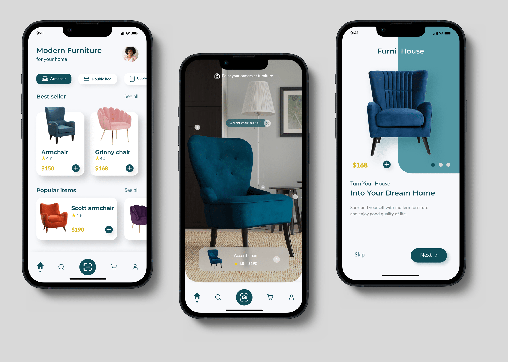
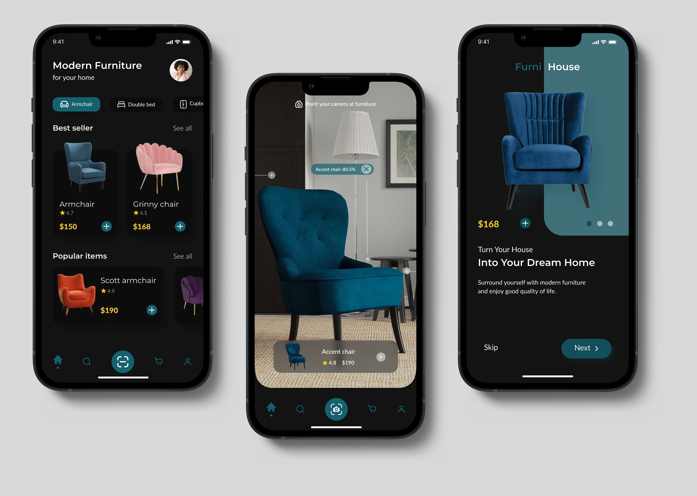
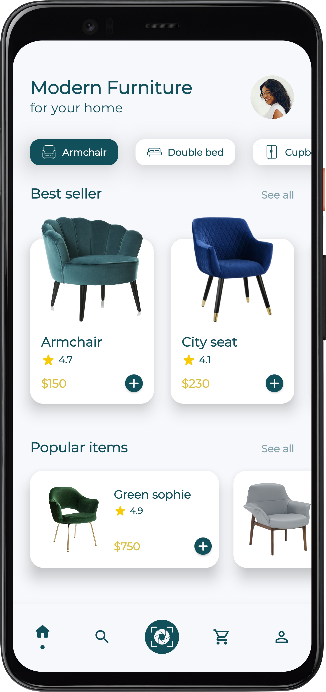
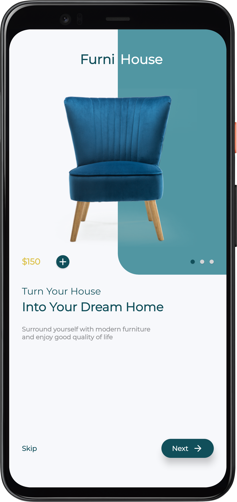
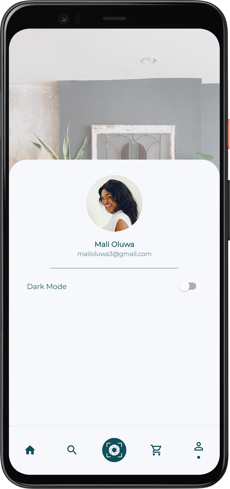
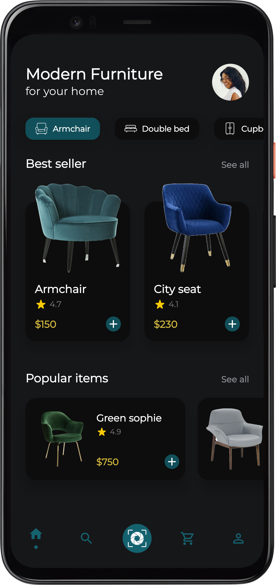
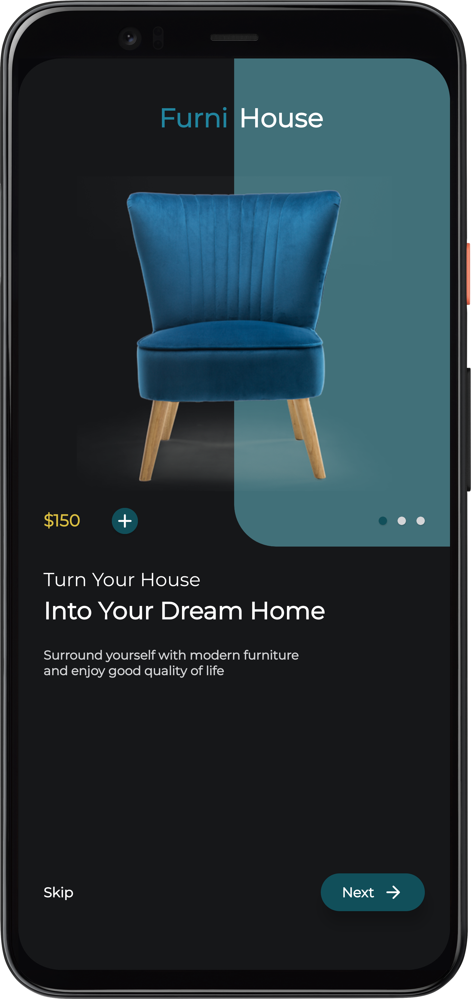
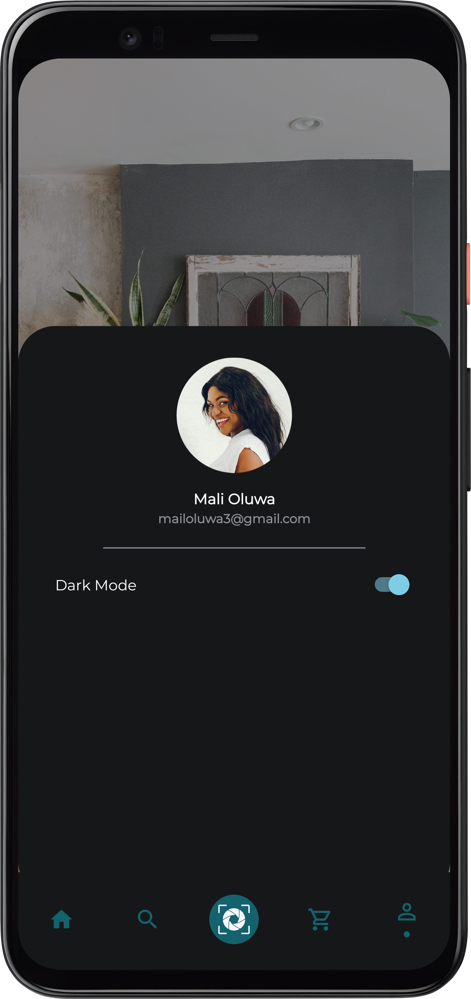

<!-- PROJECT SHIELDS -->
<!--
* I'm using markdown "reference style" links for readability.
* Reference links are enclosed in brackets [ ] instead of parentheses ( ).
* See the bottom of this document for the declaration of the reference variables
* for contributors-url, forks-url, etc. This is an optional, concise syntax you may use.
* https://www.markdownguide.org/basic-syntax/#reference-style-links
-->
[![Contributors][contributors-shield]][contributors-url]
[![Forks][forks-shield]][forks-url]
[![Stargazers][stars-shield]][stars-url]
[![Issues][issues-shield]][issues-url]
[![MIT License][license-shield]][license-url]

# Furniture Application

> Personal app project aimed to practice and further familiarize oneself with android UI concepts and creation of android Users Interfaces. UI sample from [behance](https://www.behance.net/gallery/145718211/A-Furniture-App-Design-in-Light-Dark-Mode) was used as shown below.

## UI Samples
### Light

### Dark

## Built With

- Kotlin

## App Screenshots
Below are the results from trying to imitate the designs above.

### Light
  

### Dark
  

## Getting Started

To get a local copy up and running follow these simple example steps.

### Prerequisites
-  Installed Android Studio or Any other android development IDEs and their respective dependencies

## 🤝 Contributing

Contributions, issues, and feature requests are welcome!

Feel free to check the [issues page](../../issues/).

## Show your support

Give a ⭐ if you like this project!

## Acknowledgments

-[Esther Inontah](https://www.behance.net/estherinontah_), the designer of the UI samples.

## 📝 License

This project is [MIT](./LICENSE) licensed.

<!-- MARKDOWN LINKS & IMAGES -->
<!-- https://www.markdownguide.org/basic-syntax/#reference-style-links -->
[contributors-shield]: https://img.shields.io/github/contributors/RyanKoech/FurnitureApp_UI.svg?style=for-the-badge
[contributors-url]: https://github.com/RyanKoech/FurnitureApp_UI/graphs/contributors
[forks-shield]: https://img.shields.io/github/forks/RyanKoech/FurnitureApp_UI.svg?style=for-the-badge
[forks-url]: https://github.com/RyanKoech/FurnitureApp_UI/network/members
[stars-shield]: https://img.shields.io/github/stars/RyanKoech/FurnitureApp_UI.svg?style=for-the-badge
[stars-url]: https://github.com/RyanKoech/FurnitureApp_UI/stargazers
[issues-shield]: https://img.shields.io/github/issues/RyanKoech/FurnitureApp_UI.svg?style=for-the-badge
[issues-url]: https://github.com/RyanKoech/FurnitureApp_UI/issues
[license-shield]: https://img.shields.io/github/license/RyanKoech/Crypto_Fund.svg?style=for-the-badge
[license-url]: https://github.com/RyanKoech/FurnitureApp_UI/blob/master/LICENSE